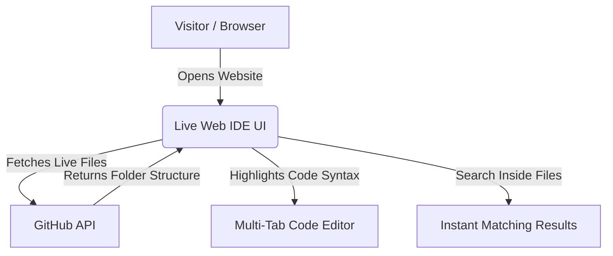

<div align="center">

# ⚡ Code-Vault

### Complete Multi-Language Coding Playground & Interactive Web IDE

[](https://git.io/typing-svg)

[](https://ritik0102-bit.github.io/Code-Vault/Code%20Portfolio/)
[](https://github.com/Ritik0102-bit/Code-Vault)


</div>

---

## 🏗️ About This Repository

Welcome to **Code-Vault**! This repository is my central software engineering archive documenting my daily coding journey across multiple programming languages and tech stacks. From core memory management and data structures in **C/C++** to cross-platform mobile apps in **React Native** and artificial intelligence healthcare projects—everything is maintained cleanly in one organized workspace.

Every folder inside this repository follows professional developer practices:
* 📐 **Fast & Efficient Code**: Writing optimized Data Structures & Algorithms ($O(1)$ to $O(N \log N)$ time complexity).
* 🧩 **Clean & Reusable**: Building structured, modular web and mobile applications.
* 🔒 **Best Practices**: Enforcing clean syntax, proper folder organization, and solid problem-solving skills.

---

## 💻 Tech Stack & Core Skills

<div align="center">

[](./C)
[](./C++)
[](./Java)
[](./Python)
[](./JavaScript)
[](./HTML)
[](./CSS)
[](./Node.js)
[](./React.js)
[](./App%20Development%20(React%20Native%20-%20Expo))
[](./Magic-Palm-Real-time-Hand-Tracking-Gesture-System)
[](./.gitignore)

</div>

---

## 🌟 Featured Innovation: Live Code Portfolio Web IDE

To make exploring this multi-language repository seamless and fun for anyone visiting, I built a custom **Live Web IDE** inside the [`/Code Portfolio`](./Code%20Portfolio) folder. 

Hosted live on GitHub Pages, this website connects directly to GitHub's servers to let you explore my entire codebase right in your browser—just like VS Code!

> [!TIP]
> Try the live portfolio website right now without downloading anything: **[Launch Web IDE](https://ritik0102-bit.github.io/Code-Vault/Code%20Portfolio/)**



### Key Website Features:
* **Automatic Live Updates**: Fetches files dynamically from GitHub. Whenever I push new code, the website updates automatically!
* **📑 Multi-Tab Editor**: Open multiple files at the same time with instant caching so switching tabs is lightning fast.
* **⚡ Deep Full-Text Search**: Type any variable or function name in the search box and press **Enter** to search deep inside the actual code across all files!
* **Modern VS Code Design**: Dark glassmorphism theme with official colored language icons (**Devicon & FontAwesome 6**).

---

## 📂 Folder Breakdown

### ⚙️ Core Languages & Algorithms
| Folder | What You Will Find Inside | Key Topics Covered |
| :--- | :--- | :--- |
| **[`/C`](./C)** | System programming & foundational concepts | Pointers, memory allocation (`malloc`/`free`), file handling, structures |
| **[`/C++`](./C++)** | High-performance problem solving | Standard Template Library (STL), Object-Oriented Programming (OOP), sorting, recursion |
| **[`/Java`](./Java)** | Object-Oriented software concepts | HashMaps, HashSets, Trees, multithreading, JDBC database connectivity |
| **[`/Python`](./Python)** | Scripting & analytical calculations | Matrix manipulations, data structure algorithms, file reading/writing |
| **[`/DSA`](./DSA)** | Data Structures & Algorithms | Dedicated algorithmic problem solving and competitive programming challenges |

### 🌐 Web & Mobile Projects
| Folder | What You Will Find Inside | Technologies Used |
| :--- | :--- | :--- |
| **[`/Code Portfolio`](./Code%20Portfolio)** | **My custom interactive web viewer (VS Code interface)** | Vanilla JavaScript, Prism.js syntax highlighter, GitHub REST API |
| **[`/React.js`](./React.js)** | Modern responsive web frontend practice | React 18+, JSX, component lifecycle, state management |
| **[`/App Development`](./App%20Development%20(React%20Native%20-%20Expo))** | Cross-platform mobile apps for Android & iOS | React Native, Expo SDK, mobile UI navigation |
| **[`/Node.js`](./Node.js)** | Backend scripting and server runtime experiments | Node.js asynchronous event loop, server scripting |
| **[`/HTML`](./HTML)** & **[`/CSS`](./CSS)** | Web design & interface layouts | Flexbox, Grid layouts, responsive animations |

### 🔬 Applied AI & Academic Projects
* 🩺 **[`INT 428 - AI Symptom Checker`](./INT%20428%20-%20AI%20Symptom%20Checker)**: AI-powered healthcare diagnostic assistants (*SymptomDiag AI* & *Vitalis AI*) built to help identify possible conditions from symptoms.
* 🖐️ **[`Magic-Palm-Real-time-Hand-Tracking`](./Magic-Palm-Real-time-Hand-Tracking-Gesture-System)**: Computer Vision gesture application using **Python & OpenCV** to detect hand movements in real-time through a webcam.
* 🖥️ **`CSE 316 - OS Project`**: Operating System project demonstrating process scheduling algorithms (Round Robin, Shortest Job First).

---

## 📊 GitHub Profile Stats

<div align="center">
  
  
</div>

---

## ⚡ How to Run Code Locally

### Clone the Repository
```bash
git clone https://github.com/Ritik0102-bit/Code-Vault.git
cd Code-Vault
```

### Run Programs
```bash
# Compile and run C++ code
g++ C++/hello.cpp -o main.exe && ./main.exe

# Compile and run Java code
javac Java/Array_List.java && java Java/Array_List

# Execute Python scripts
python Python/Python_Basics.py
```

---

## 📬 Connect With Me

<div align="center">

[](https://github.com/Ritik0102-bit)

**Built with ❤️ by Ritik** • *Always learning, coding, and building cool things.*

</div>
